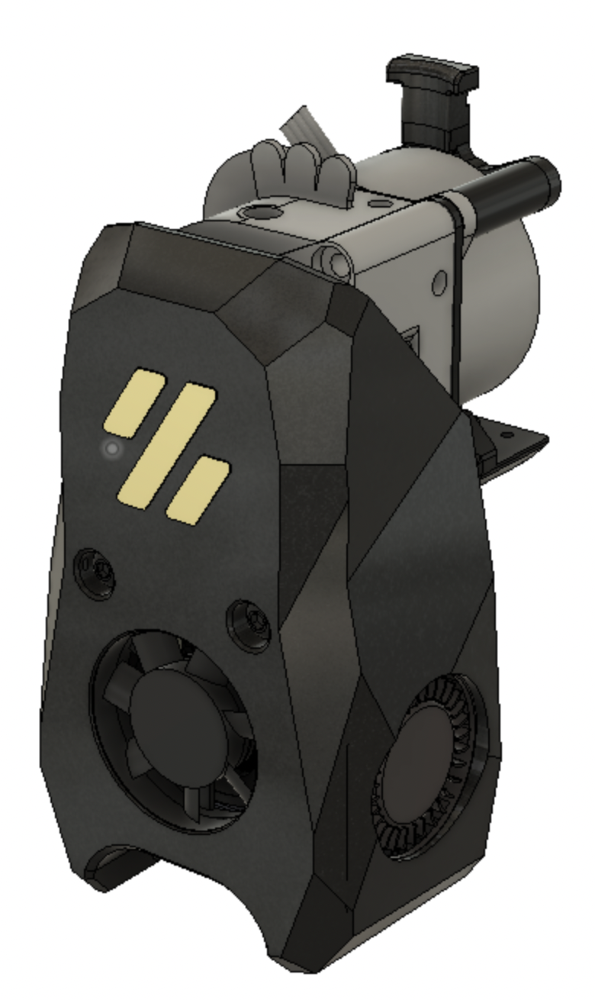
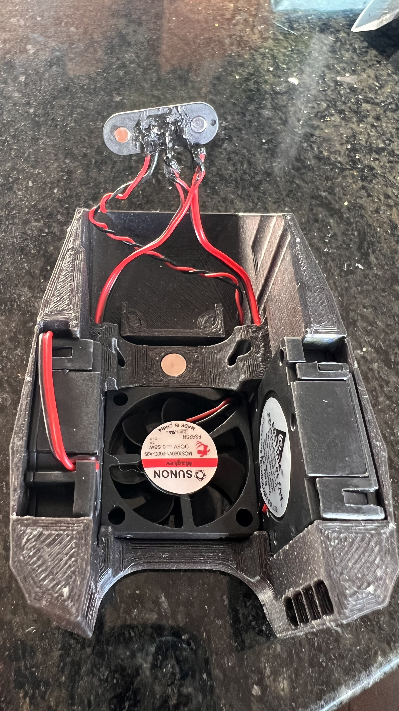

# Smol-Stealth-Burner-V0.1-Mod
This Smol stealth burner does not lose any X,Y or Z travel. This means on stock V0.1 you don't need new bed mounts and you don't need to remove your stock bed. It has all best features I wanted in a Smol hotend without taking apart half your printer!

# License:
https://github.com/VoronDesign/Voron-0/blob/Voron0.1/LICENSE

I would say this is an intermediate build. You will need knowledge of soldering as well as wiring in general. You will need to work with small objects that can be a pain for unsteady hands. please keep this in mind.

# I AM NOT RESPONSIBLE FOR ANY DAMAGES TO YOUR PRINTER. PERFORM THIS MOD AT YOUR OWN RISK.

Print settings are standard Voron settings. The only exception is the X carraige. This will need support. There are two X carraige types. One with auto generated support and one without. I recommend printing the one without but if you don't trust your slicer use the one with. No way around it. You want the full x,y travel? Sacrafices have to be made. Don't worry its not a lot and should come off easy if they are dialed in.

# BOM
Currently ONLY LGX lite with dragon is supported if I have time I may help someone adapt other extruders and or hotends.

1. Two M3x35mm, Two M3x20mm socket or cap screws to screw in LGX Lite, two M2.5x4mm hotend mounting bolts socket or cap works.
2. A set of pogo pins. You will need to select. 4PIN SMD MALE AND FEMALE and I opted to buy more to have as spares testing I have no issues and they are rated to have enough to power the fans. https://www.aliexpress.com/item/1005003511237426.html?spm=a2g0o.productlist.0.0.19ef6d67f3sBNk&algo_pvid=a7257952-b1d4-4948-9495-a111bfa022f6&aem_p4p_detail=202204292020154509380800919520001935181&algo_exp_id=a7257952-b1d4-4948-9495-a111bfa022f6-4&pdp_ext_f=%7B%22sku_id%22%3A%2212000026116527374%22%7D&pdp_npi=1%40dis%7CUSD%7C%7C1.35%7C%7C%7C3.83%7C%7C%40210318b916512888151663045ed553%7C12000026116527374%7Csea
3. A fine tip Soldering iron. Trust me this will not be fun without it.
4. Four 6x3mm magnets like all cool voron mods use.
5. Liquid electrical tape. Yes it is a thing.

# Steps for assemble cowling and mount with pogo pins.
  The magnets should have a press fit into the printed parts some might need glue from going too far in.
1. Make sure you have no connectors attached to your fans.
2.Start by feeding the cables through the channels I have made in the Cowling. Photos to show if your wires are too big cut them with some EXTRA INCASE YOU MESS UP. Dont worry there is plenty of space to hide them. :)
3. Cut a length of what you need to reach from the pogo pins to whatever setup your running. That means to reach your printer board. In the photos I am using the umbilical PCB by Timmit. Link: https://github.com/VoronDesign/Voron-Hardware/tree/master/V0-Umbilical I used approx 110mm of PTFE cable.
4. Tin the back side of the pogo pins. A little is all you need don't overdue it. The sides that do not have a spring pin or are indented. They should be FLAT.
5. Tin the negative and positive hotend fan ends. A little is all you need don't overdue it. Solder the hotend fan negative and positive two the back of pogo pins where you tinned. 
6. Twist both part cooling fan negatives wires together and repeat for positive. Tin these twisted wires. A little is all you need don't overdue it. Next Solder them to the two pins that are left on the pogo pins.. TO be on the safe side make sure negatives are next to each other so that if you are sloppy at least the wires are grounded.

8. Repeat these steps for the hotend mount side. Making sure to wire in one to one with the other. Meaning hotend fan positive lines up with hotend postive, Hotend negative lines with negative. Same goes for the part cooling fans. Double and triple Check. This is easy to mess up. Dont fry your poor 5v hotend fan.
9. Once you verified it is wired correctly Apply liquid electrical tape. This is for safety last thing we need is exposed wires and solder flying around at 100mm/s coming loose and touching. This seals but also insulates all your work.
10. Now these connectors should press in to the provided channels with the pogos facing each other.

Voilà you now have an easy to work on hotend you have made it this far grab a cookie or take a drink.
They should pull to each other and make contact.

Pogo_pins_video.mov

Klipper does not like when certain things aren't connected so if you get an error make sure the pogos are connected when turning on your printer. Safety first klipper well done.
Thanks to @MAVERICK on discord for the inspiraion and guidance. Check out all the cool work he has done. https://github.com/PrintersForAnts/Crucible
